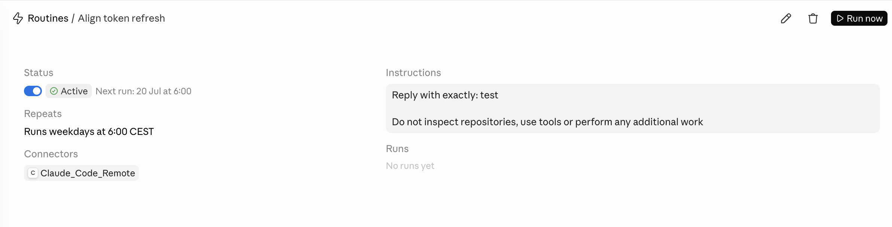

# Andrea's Developer Setup


[](#)

## How to run

1. For each environment variable in _.env.example_, run `export VARIABLE_NAME=value`
2. Run the tracked `./run.sh`

## Testing

To test the playbook before applying it to a machine use [Tart](https://tart.run/quick-start/):

```bash
brew install cirruslabs/cli/tart
tart clone ghcr.io/cirruslabs/macos-sequoia-base:latest sequoia-base
tart clone sequoia-base test-dev-setup
tart run test-dev-setup
ssh admin@$(tart ip test-dev-setup)
```

**DOCKER MAY NOT WORK!!**

## Contents

### Terminal

Task: `tasks/terminal.yml`

We use **iTerm2** as the terminal, **Oh My Zsh** for customisation, and **tmux** for sessions.

This is a small tmux cheatsheet:

| Action                     | Command                 |
| -------------------------- | ----------------------- |
| New session                | `tmux new -s {NAME}`    |
| Close session              | `tmux detach`           |
| Re-enter session           | `tmux attach -t {NAME}` |
| Split vertically           | `CTRL a \|`             |
| Split horizontally         | `CTRL a -`              |
| Navigate terminals         | `CTRL hjkl`             |
| Maximise/minimise terminal | `CTRL a m`              |
| Resize window              | `CTRL a hjkl`           |
| New window                 | `CTRL a c`              |
| Rename window              | `CTRL a ,`              |

`terminal/.zshrc` contains some aliases for _Python_ and _Docker_.

### Neovim

Task: `tasks/neovim.yml`

The Neovim task is currently disabled because its `setup.yml` include is commented out. Enable it there, or deploy directly with:

```bash
stow --restow --no-folding --target "$HOME" neovim
```

Java support uses JDTLS with Spring Boot language-server extensions, debugging, tests, and Palantir formatting.

Supermaven provides inline AI completions. Start with `:SupermavenUseFree`, or use `:SupermavenUsePro` for an existing Pro account.

Machine-specific Neovim settings belong in
`neovim/.config/nvim/local.lua`, which is ignored by Git. For example, disable
format-on-save while retaining manual formatting with:

```lua
vim.g.disable_autoformat = true
```

This is a small neovim cheatsheet:

| Action                         | Command           |
| ------------------------------ | ----------------- |
| Search for file                | `space ff`        |
| Search for string              | `space fs`        |
| Toggle file-tree               | `space ee`        |
| Open file-tree on current file | `space ef`        |
| Collapse file-tree             | `space ec`        |
| Refresh file-tree              | `space er`        |
| Toggle breakpoint              | `space db`        |
| Start debugger                 | `space dc`        |
| Quit debugger                  | `space dq`        |
| Step over                      | `space do`        |
| Focus on code                  | `space d0`        |
| Focus on scopes (variables)    | `space d1`        |
| Focus on watches               | `space d4`        |
| Focus on REPL                  | `space d5`        |
| Create mark                    | `m <a-z>`         |
| Go to mark                     | `' <a-z>`         |
| Toggle comment                 | `CTRL /` or `gcc` |
| Format file                    | `space fmt`       |
| Lint file                      | `space lf`        |
| Code actions                   | `space ca`        |
| Go to definition               | `space gd`        |
| Show references                | `space gr`        |
| Rename symbol                  | `space rn`        |
| Show docs                      | `K`               |
| Next diagnostic                | `]d`              |
| Previous diagnostic            | `[d`              |
| Show workspace diagnostics     | `space xw`        |
| Add file to Harpoon            | `space ha`        |
| Clear Harpoon                  | `space hc`        |
| Harpoon navigate               | `space h<1-4>`    |
| Toggle rendered Markdown       | `space op`        |
| Split vertically               | `space sv`        |
| Split horizontally             | `space sh`        |
| Close split                    | `space sx`        |

### Visual Studio Code

Task: `tasks/vscode.yml`

VS Code uses separate keybindings and settings.

`keybindings.json` is stowed (live symlink). `settings.json` is handled by `vscode/merge_settings.py`:

- **No `vscode/settings.local.json`** -> base is symlinked, so edits are live (no re-run needed).
- **`vscode/settings.local.json` present** -> base + local are deep-merged into a generated file (cannot be a symlink). Edits to either source are **not** live.

To override VSCode settings on one machine, create `vscode/settings.local.json` with only the keys you want to override; for example to disable Python autoformat on a specific machine:

```json
{
    "[python]": {
        "editor.formatOnSave": false,
        "editor.codeActionsOnSave": {
            "source.organizeImports": "never"
        }
    }
}
```

After editing the base VSCode `settings.json` or `vscode/settings.local.json`, re-apply with:

```bash
ansible-playbook setup.yml --tags vscode
```

Extensions are managed via `vscode/manage_extensions.py`:

```bash
python3 vscode/manage_extensions.py --install    # install missing extensions from extensions.json
python3 vscode/manage_extensions.py --uninstall  # uninstall all extensions
python3 vscode/manage_extensions.py --reinstall  # uninstall all, then install from extensions.json
python3 vscode/manage_extensions.py --list       # list installed extensions with versions
```

Local extensions are kept in `vscode/extensions`. The VSCode task symlinks
`vscode/extensions/copy-reference` into
`~/.vscode/extensions/dev-setup.copy-reference-0.1.0`.

The `copy-reference` extension contributes the `copyReference.copy` command
(`Copy File Reference`), bound to `space c p` in Normal or Visual Vim mode. It
copies a reference for the active editor to the clipboard:

| Selection     | Clipboard value                        |
| ------------- | -------------------------------------- |
| No selection  | `path/to/file.ext`                     |
| Selected text | `path/to/file.ext:start_line:end_line` |

Paths are workspace-relative for files inside the current workspace. Files
outside a workspace use their absolute path, and non-file editors use their URI.
The optional prompt support is currently disabled in the extension source.

The command was inspired by
[smnatale's copy command gist](https://gist.github.com/smnatale/b30dc21ff330495641fb59f36005562c).

### Apps

Task: `tasks/apps.yml`

- [](#)
- [](#)
- [](#)
- [](#)
- [](#)
- [](#)
- [](#)

## Claude (Code)

Task: `tasks/claude.yml`

Installs the Claude Code cask, language servers (jdtls, pyright, gopls), CodeGraph, and Context Mode. Links `.claude/*` to `~/.claude/*` (machine-specific MCP registrations stay in untracked `~/.claude.json`). Run `codegraph init` once per repo.

### Agentic Principles

1. The agent alleviates the user from lengthy and repetitive tasks. The `planner` skill is human-in-the-loop. The engineer takes responsibility for decisions, architecture, reviewing the skeleton of the implementation and test plan, then the agents execute based on that.
2. The main thread is an orchestrator; it is to remain light for user messages and to synthesise what is delegated to subagents.
3. The engineer is responsible for the codebase, not the agents. The setup is hostically designed for the engineer to have NeoVim with the code to the left of a tmux session, plus an agent and a terminal for tests etc to the right. The directives provided to the model aim to make it code and speak in a human-like manner as much as possible.

### Custom agents

| Agent             | Model  | Purpose                                                                                             |
| ----------------- | ------ | --------------------------------------------------------------------------------------------------- |
| `explorer`        | haiku  | Read-only evidence collection (CodeGraph first, Context Mode sandbox for noisy output); never edits |
| `builder`         | sonnet | Focused edits to code, tests, and config with semantic judgement                                    |
| `artifact-writer` | haiku  | Deterministic renders of approved docs/fixtures and mechanical config edits; no source logic        |

### Hooks

Two `PreToolUse` hooks are adapted from Spotify's [Shunt](https://github.com/spotify/portal-ai-plugins/tree/master/plugins/shunt) plugin — see [Portal by Spotify cut my Claude Code token usage by 90%](https://engineering.atspotify.com/2026/9/portal-by-spotify-cut-my-claude-code-token-usage-by-90) for the pattern.

| Hook                          | Event          | Matcher            | Source                                       | Purpose                                                                                                                                                               |
| ----------------------------- | -------------- | ------------------ | -------------------------------------------- | --------------------------------------------------------------------------------------------------------------------------------------------------------------------- |
| `block-secret-exposure.py`    | `PreToolUse`   | `Bash\|Read\|Grep` | `.claude/scripts/block-secret-exposure.py`   | Blocks plaintext secret disclosure (`op read`, `bw get`, `sops -d` to stdout, untrapped temp-file redirects, `kubectl get secret -o yaml/json`, sensitive file reads) |
| `check-file-size`             | `PreToolUse`   | `Read`             | `.claude/hooks/check-file-size` (from Shunt) | Blocks full reads of files >350 lines; redirects to `/shunt-bulk-reader` or offset/limit reads                                                                        |
| `check-bash-read`             | `PreToolUse`   | `Bash`             | `.claude/hooks/check-bash-read` (from Shunt) | Blocks `cat/head/tail` on files >350 lines; piped/filtered reads pass through                                                                                         |
| `context-mode-cache-heal.mjs` | `SessionStart` | —                  | `.claude/hooks/context-mode-cache-heal.mjs`  | No-op stub; real cache healing is owned by the `context-mode` plugin when installed                                                                                   |

### Skills

| Skill                         | Purpose                                                               |
| ----------------------------- | --------------------------------------------------------------------- |
| `airflow`                     | DAG/task authoring and live Airflow operations                        |
| `coding`                      | Mandatory policy for all code, test, and code-review work             |
| `council`                     | Five-advisor stress test for high-stakes decisions                    |
| `debugger`                    | Log/stack-trace-driven diagnosis and repair                           |
| `docker`                      | Dockerfiles and compose authoring/troubleshooting                     |
| `explain-code`                | Code walkthrough with diagrams and gotchas                            |
| `feature-spec`                | Strict intake spec collection (no implementation)                     |
| `git`                         | Git operations via the curated CLI reference                          |
| `glab`                        | GitLab/MR/pipeline operations                                         |
| `plan-execute`                | Dispatch of approved plan bundles (Sonnet orchestrator)               |
| `planner`                     | Human-in-the-loop planning on Opus (produces `plans/<slug>/`)         |
| `prometheus`                  | PromQL instant/range queries and metric discovery                     |
| `review-code`                 | Concrete correctness/maintainability/performance review               |
| `session-efficiency-reviewer` | Local transcript cost audit (no prompt/tool output emitted)           |
| `shunt-bulk-reader`           | Delegate bulk reads (>350 lines / 3+ files) to Haiku via Context Mode |

### Statusline

`settings.json:147` runs `bash ~/.claude/statusline.sh` (`statusline.sh:1`). Single-line, `│`-separated, colour-coded:

| Segment        | Source                                                                                    | Display                                                        |
| -------------- | ----------------------------------------------------------------------------------------- | -------------------------------------------------------------- |
| Model          | `model.display_name`                                                                      | magenta                                                        |
| Context        | `context_window.used_percentage`                                                          | `█`/`░` bar (10 chars) + % — green <50%, yellow <80%, red ≥80% |
| Git branch     | `git symbolic-ref --short HEAD` (fallback `rev-parse --short`) in `workspace.current_dir` | green                                                          |
| 5h / 7d limits | `rate_limits.five_hour` / `seven_day`                                                     | `5h:N%` / `7d:N%` with same threshold colours                  |
| Duration       | `transcript_path` birth time (`stat -f '%B'`)                                             | dim `Hh Mm` / `Mm`                                             |
| Project        | `workspace.current_dir` basename                                                          | bold cyan                                                      |

### Output style, CLAUDE.md, and rules

| File                                     | Role                                                                                                                                                   |
| ---------------------------------------- | ------------------------------------------------------------------------------------------------------------------------------------------------------ |
| `output-styles/Straight_to_the_Point.md` | Active output style (`settings.json:172`): lead with the answer, plain British English, no filler or em dashes; layered on `settings.json:outputStyle` |
| `CLAUDE.md:1`                            | Core behavioural instructions; re-exports binding rules and the CodeGraph/Context Mode token-efficiency policy                                         |
| `rules/safety.md`                        | Secret handling and conclusive-operation approvals                                                                                                     |
| `rules/coding.md`                        | Requires the `coding` skill for code-facing work                                                                                                       |
| `rules/workflow.md`                      | Investigate before asking; surgical scope; evidence-backed handoffs                                                                                    |
| `rules/subagents.md`                     | Orchestrator/worker routing, model selection, and sandbox discipline                                                                                   |
| `rules/interaction.md`                   | macOS/Zsh/Homebrew environment and interaction preferences                                                                                             |
| `rules/config-management.md`             | Edit `dev_setup/.claude`, not `~/.claude`; consolidate before adding config                                                                            |

### Routines

Inspired by [this LinkedIn post](https://www.linkedin.com/posts/fabian-wesner_a-quick-tip-on-claude-codes-5-hour-usage-activity-7468185272250281984-Dek0)

Go to [https://claude.ai/code/routines](https://claude.ai/code/routines) and create a routine as shown below:



## Dotfiles managed by Stow

| Package                                                         | Symlinks to                                                                                                 |
| --------------------------------------------------------------- | ----------------------------------------------------------------------------------------------------------- |
| `terminal/.zshrc`                                               | `~/.zshrc`                                                                                                  |
| `terminal/.p10k.zsh`                                            | `~/.p10k.zsh`                                                                                               |
| `tmux/.tmux.conf`                                               | `~/.tmux.conf`                                                                                              |
| `neovim/.config/nvim`                                           | `~/.config/nvim` (a real directory containing individual symlinks because Neovim uses `--no-folding`)       |
| `vscode/Library/Application Support/Code/User/settings.json`    | `~/Library/Application Support/Code/User/settings.json` (handled by `vscode/merge_settings.py`, not stowed) |
| `vscode/Library/Application Support/Code/User/keybindings.json` | `~/Library/Application Support/Code/User/keybindings.json`                                                  |
| `.claude` tracked config files                                  | `~/.claude/...` (individual symlinks)                                                                       |

## Credits

[Josean Martinez](https://www.youtube.com/@joseanmartinez)

- [Terminal setup](https://www.youtube.com/watch?v=CF1tMjvHDRA)
- [Colour scheme](https://github.com/josean-dev/dev-environment-files/tree/main)
- [tmux setup](https://www.youtube.com/watch?v=U-omALWIBos)
- [Neovim setup](https://youtu.be/6pAG3BHurdM?si=jjdpf5qU7i6ukMZC)
- [Neovim LSP](https://youtu.be/oBiBEx7L000?si=fNd8ogijBijMQtBo)

[ThePrimeagen](https://www.youtube.com/@ThePrimeagen)

- [Neovim setup](https://www.youtube.com/watch?v=c0Xmd4PGino)

[Levi Wilkerson](https://www.youtube.com/@frostytf2)

- [Neovim-like setup for VSCode](https://www.youtube.com/watch?v=l7CMlJRE5Hw)

[NeuralNine](https://www.youtube.com/@NeuralNine)

- [Python DAP](https://www.youtube.com/watch?v=tfC1i32eW3A)

[Dreams of Code](https://www.youtube.com/@dreamsofcode)

- [Go DAP](https://www.youtube.com/watch?v=i04sSQjd-qo)

Terminal font created by [romaktv](https://github.com/romkatv/powerlevel10k-media/blob/master/MesloLGS%20NF%20Regular.ttf)
